# 12-Week AWS Challenge: EC2 Automation with Lambda, EventBridge, and SNS


Project Overview

Business Use Case

Architecture

### Table of Contents

- [Project Overview](#project-overview)
- [Business Use Case](#business-use-case)
- [Architecture](#architecture)
- [Step 1: Launch EC2 Instances](#step-1-launch-ec2-instances)
- [Step 2: Create the Lambda IAM Role](#step-2-create-the-lambda-iam-role)
- [Step 3: Create SNS Topic](#step-3-create-sns-topic)
- [Step 4: Create the Lambda Function](#step-4-create-the-lambda-function)
- [Step 5: Create EventBridge Rules](#step-5-create-eventbridge-rules)
- [Step 6: Test Lambda Manually](#step-6-test-lambda-manually)
- [Step 7: Testing the Schedule](#step-7-testing-the-schedule)
- [Step 8: Verify Notifications](#step-8-verify-notifications)


## Project Overview

This project automates the scheduled start and stop of multiple EC2 instances using serverless AWS services: Lambda, EventBridge, and SNS.

Business Use Case

*Organizations often run development or test EC2 instances that don’t need to be active 24/7. This automation provides:*

**Cost savings by shutting down instances outside working hours.**

**Reliability, ensuring instances are up during business hours.**

**Automation, removing manual intervention.**

**Notifications via SNS about instance activity.**

**Fully serverless and maintenance-free.**


# EventBridgeLambda Architecture

This architecture demonstrates a **serverless automation solution** to manage EC2 instances using AWS services in a secure, decoupled, and scheduled manner.

> **Architecture Diagram:** `EventBridgeLambda.drawio` (located in the root directory)  
> 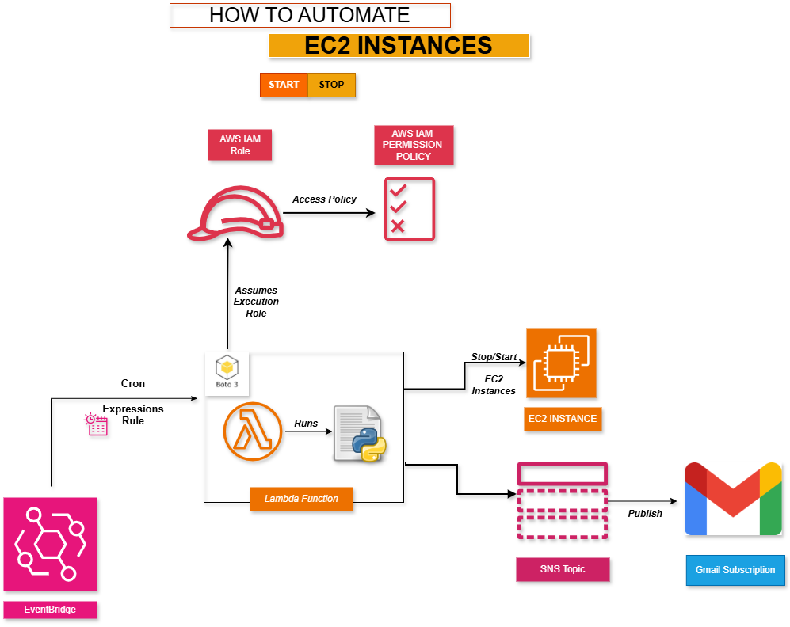

---

## Overview

The solution automates starting and stopping EC2 instances on a schedule while sending notifications for auditing. It is built using five primary AWS components:

---

## 1. Scheduler / Trigger: Amazon EventBridge

- **Function:** Acts as the centralized scheduler for the automation.
- **Mechanism:** A Cron Expressions Rule is configured in EventBridge to define precise schedules, e.g.:
  - Stop all instances at 7 PM.
  - Start all instances at 8 AM.
- **Flow:** When the scheduled time occurs, EventBridge emits an event that triggers the Lambda Function.

---

## 2. Core Logic: AWS Lambda Function

- **Function:** The Lambda function is the compute engine executing the automation logic.
- **Implementation:** Runs a Python script that uses **Boto3** (AWS SDK) to interact with EC2 instances.
- **Flow:** 
  1. Receives the event from EventBridge.
  2. Assumes the assigned IAM execution role.
  3. Performs the `Stop` or `Start` action on the targeted EC2 instances.

---

## 3. Permissions and Security: AWS IAM Role & Policy

- **IAM Role:** Lambda assumes an execution role to perform actions securely.
- **IAM Permission Policy:** Restrictive policy granting only the necessary permissions:
  - `ec2:StartInstances`
  - `ec2:StopInstances`
- **Flow:** Lambda uses this role to authenticate and perform EC2 operations without exposing credentials.

---

## 4. Target Resource: AWS EC2 Instances

- **Function:** The EC2 instances are the resources being managed (stopped or started).
- **Integration:** Lambda communicates directly with EC2 API endpoints to change the instance state.

---

## 5. Notification System: AWS SNS and Gmail

- **Function:** Provides real-time notifications and audit trails.
- **Flow:**
  1. After stopping or starting instances, Lambda publishes a status message to an **SNS Topic**.
  2. The SNS topic is configured with a **Gmail subscription**.
  3. The subscriber receives an immediate email confirming the action.

---

## End-to-End Flow

1. **EventBridge Cron Rule** triggers the **Lambda Function** based on the schedule.
2. Lambda assumes the **IAM Role** to gain permission to manage EC2 instances.
3. Lambda executes the Python script to **Stop or Start EC2 instances**.
4. Lambda publishes a **status message to the SNS Topic**.
5. The SNS Topic sends a notification to the subscribed **Gmail account**.
6. This ensures all actions are automated, auditable, and secure.


___
___

## Step 1: Launch EC2 Instances

Create three EC2 instances.

Record their Instance IDs.

Ensure the security group allows required access.

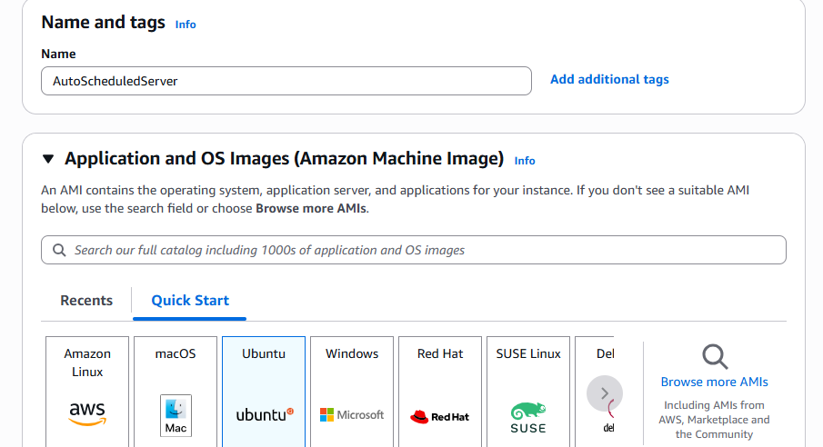

**EC2 Instance Creation**

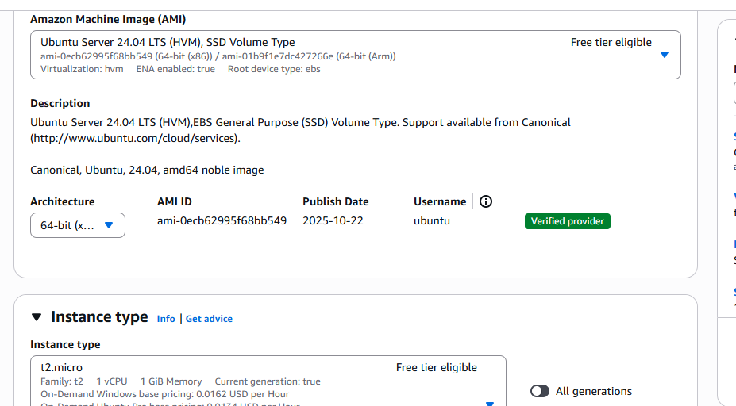

**EC2 Instance Creation**

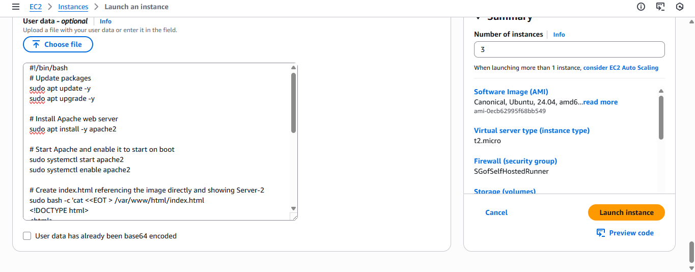

**Userdata for bootstrapping a simple website**

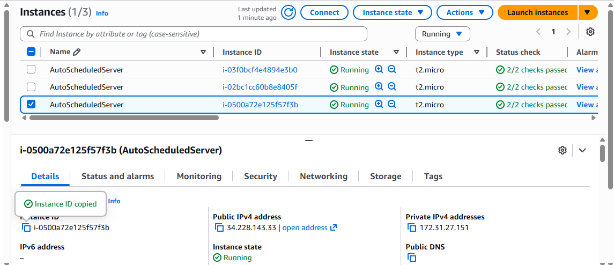

**Instances created and running**

---

## Step 2: Create the Lambda IAM Role

*Open IAM → Roles → Create Role.*

Select AWS Service → Lambda.

Attach the policy below.

Name the role: LambdaEC2AutomationRole.

```json
IAM Policy (JSON)
{
  "Version": "2012-10-17",
  "Statement": [
    {
      "Effect": "Allow",
      "Action": [
        "ec2:StartInstances",
        "ec2:StopInstances",
        "ec2:DescribeInstances"
      ],
      "Resource": "*"
    },
    {
      "Effect": "Allow",
      "Action": [
        "sns:Publish"
      ],
      "Resource": "arn:aws:sns:REGION:ACCOUNT_ID:EC2AutomationTopic"
    }
  ]
}

```


**Lambda execution role**


**Lambda execution role**


---

## Step 3: Create SNS Topic

Open SNS → Topics → Create Topic.

Name it EC2AutomationTopic.

Create an email subscription.

Confirm the subscription from your inbox.

### Image: CreateSNSTopic

*Description: Screenshot showing the creation of the SNS topic used for notifications in the Lambda automation workflow.*


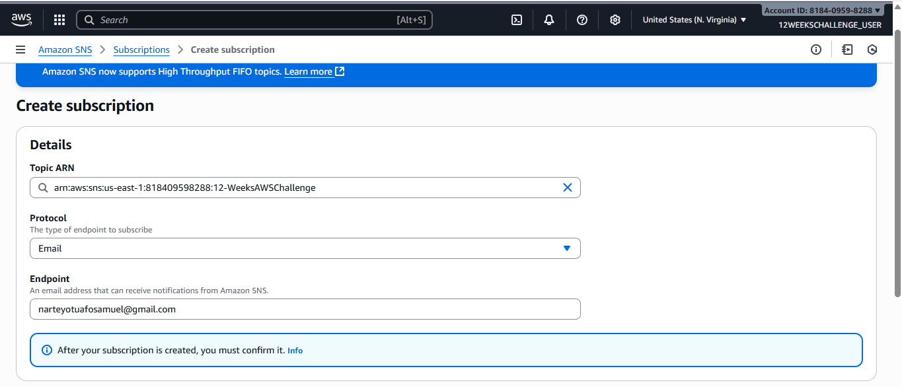

**SNS Topic Creation**

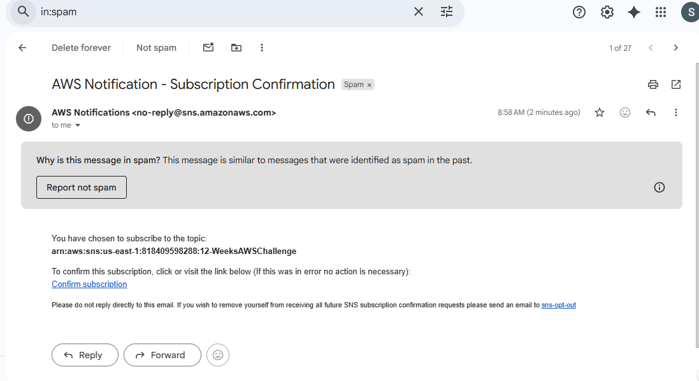

**Subscription confirmation**

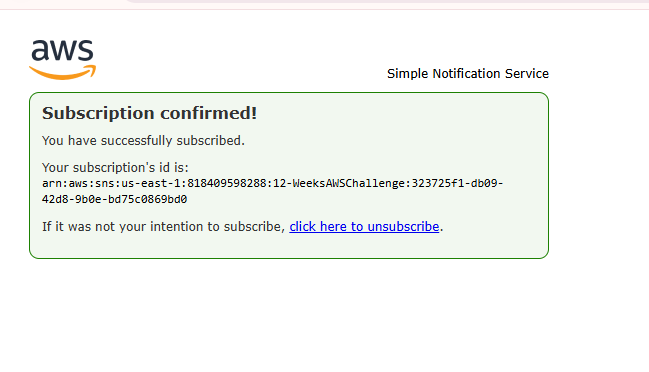

**Subscription confirmation**

---

## Step 4: Create the Lambda Function

Go to Lambda → Create Function.

Name: EC2StartStopFunction.

Runtime: Python 3.9+.

Attach the IAM role created earlier.

Add environment variables:

```
INSTANCE_ID=ISTANCE_ID_1,ISTANCE_ID_2,INSTANCE_ID_3
SNS_TOPIC_ARN=arn:aws:sns:REGION:ACCOUNT_ID:EC2AutomationTopic
CUSTOM_AWS_REGION=us-east-1

```

### Image: createfunction1
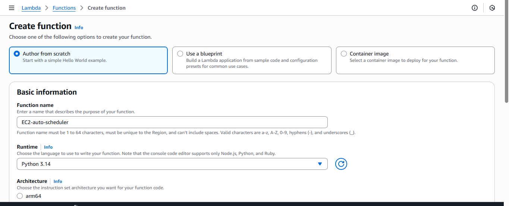
*Description: Screenshot showing the creation of the Lambda function `createfunction1`, including its configuration and setup.*


### Image: lambda
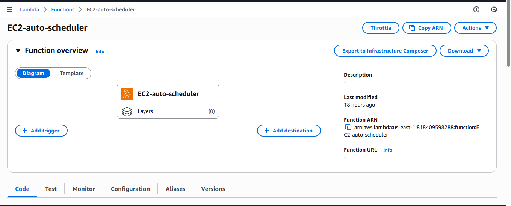
*Description: Screenshot showing the Lambda function configuration, code, or execution related to EC2 automation.*

### Image: lambda1
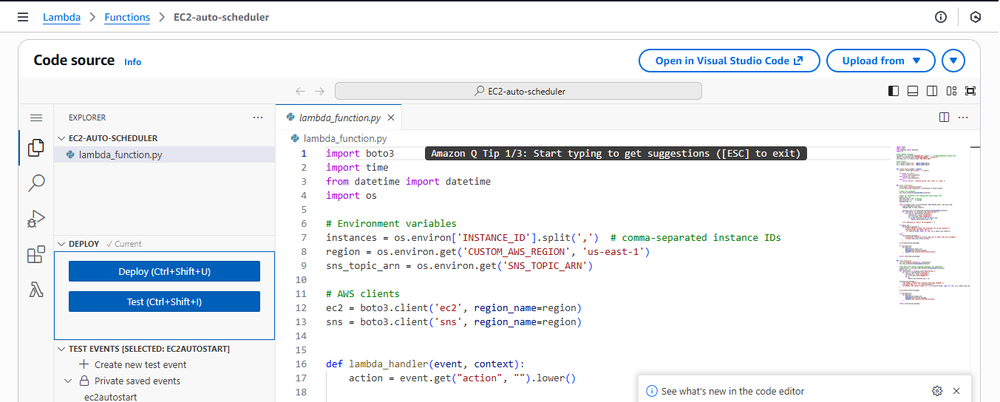
*Description: Screenshot of Lambda function `lambda1` showing its configuration or code for EC2 automation.*


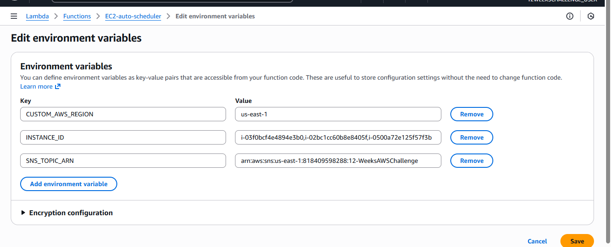

**Lambda environment variable configuration**


This architecture ensures **secure, scheduled, and observable control over EC2 resources** using serverless AWS services.


[View the script](LambdaFunction.py)  
*Refer to the `LambdaFunction.py` file for the Lambda function code.*


## Step 5: Create EventBridge Rules

Production Schedule:

```
Action	Schedule
Start	07:00 UTC, Monday–Friday
Stop	19:00 UTC, Monday–Friday

Event Input: Start

{
  "action": "start"
}


Event Input: Stop

{
  "action": "stop"
}

```


### Image: cronforstartinstance
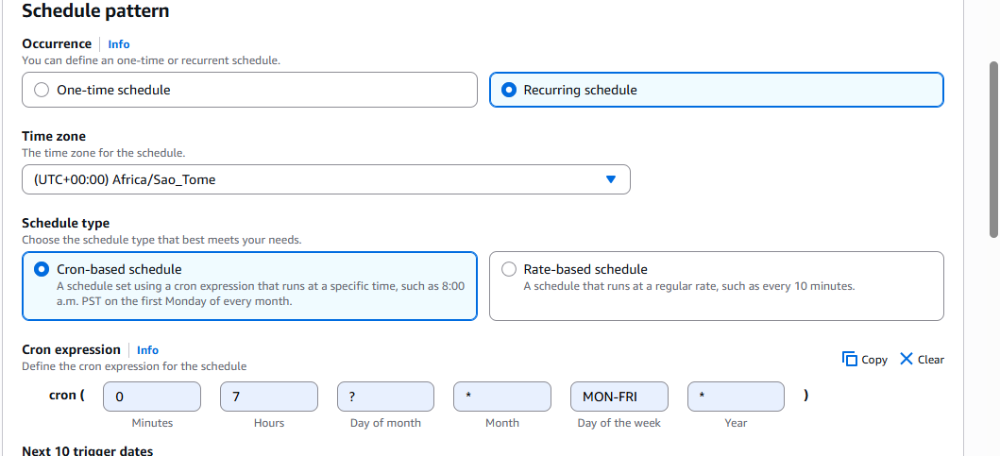
*Description: Screenshot showing the cron schedule configuration for starting EC2 instances.*

### Image: cronforstartinstance1
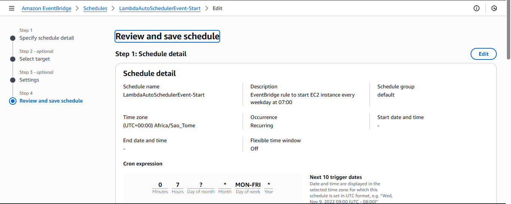
*Description: Another view of the cron schedule for starting EC2 instances, highlighting timing or configuration details.*

### Image: cronforstartinstance3
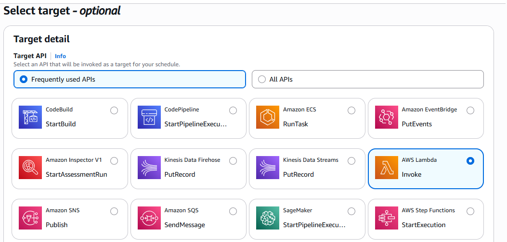
*Description: Screenshot showing an additional cron setup or variant for automated EC2 instance start.*

### Image: cronforstartinstance4
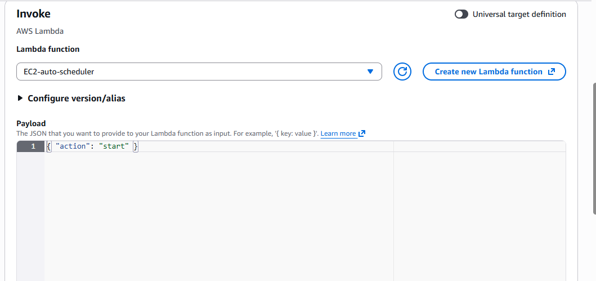
*Description: Screenshot illustrating a further cron schedule example for starting EC2 instances.*

### Image: cron-schedules
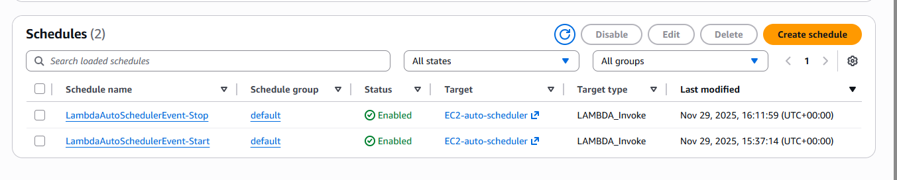
*Description: Overview of all configured cron schedules for EC2 automation in the Lambda workflow.*

---


## Step 6: Test Lambda Manually

```
Test Event: Start


{
  "action": "start"
}


Test Event: Stop

{
  "action": "stop"
}

```
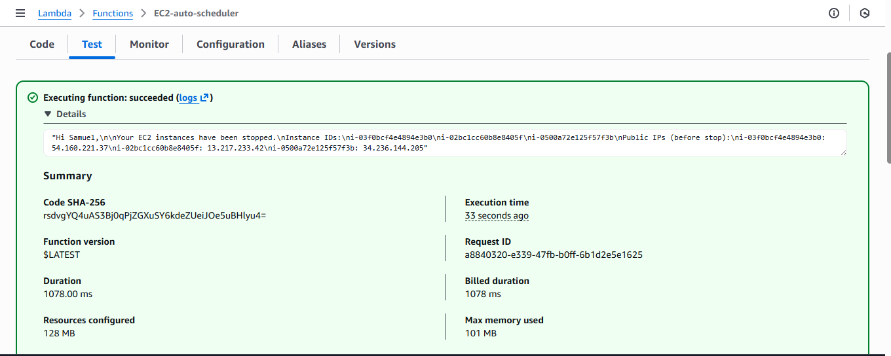
*Manually testing the Lambda function using a stop event to validate EC2 instance shutdown.*


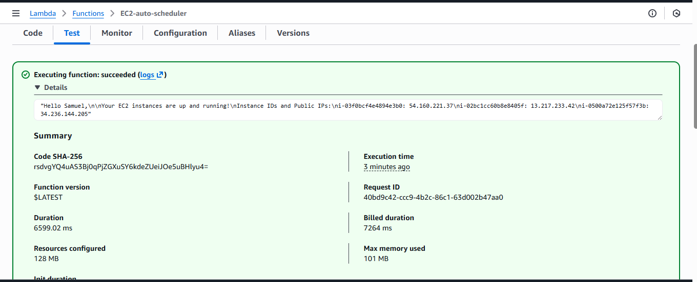
*Testing the Lambda function with a start event to verify automated EC2 instance startup.*

---


## Step 7: Testing the Schedule

**NB: This part of the project was carried out to test the functionality of the Lambda function and to demonstrate how EventBridge can trigger the function to execute its logic and publish a message to the subscriber via SNS. The main goal, automatically starting the EC2 instance at 7:00 AM and stopping it at 8:00 PM (or 7:00 PM) daily, is shown in Step 5. However, these screenshots reflect test runs rather than the full scheduled operation, with the start and stop of the instances occurring after 4 minutes and 2 minutes respectively.**


Test Cron Schedule:

```
Start every 2 minutes

Stop every 4 minutes
```

### Image: schedule

### Image: stopinstancerunning2
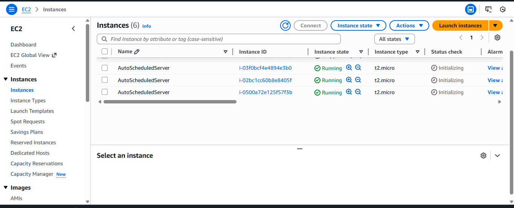
*Description: EC2 dashboard screenshot showing that the instance is currently running.*

### Image: stoprunninginstance2

*Description: EC2 dashboard screenshot showing that the instance has been stopped.*


*** Purpose: ***

Validate EventBridge triggers Lambda.

Confirm EC2 instances start/stop correctly.

Verify SNS notifications delivery.

---

## Step 8: Verify Notifications

SNS sends an email containing:

#### Action performed

#### Instance IDs affected

#### Public IPs of running instances


*Description: Email notification showing that the EC2 instance has started, including its Instance ID and public IP.*

### Image: stopinstance2
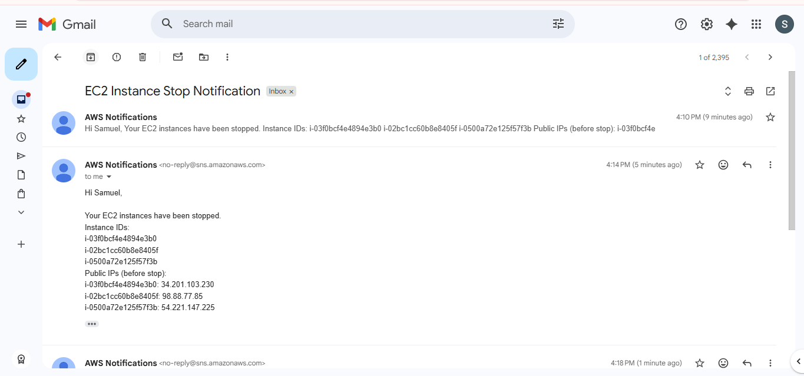
*Description: Email notification indicating the EC2 instance has been stopped, showing its Instance ID and previous IP.*

### Benefits

Reduces AWS cost by automating instance uptime.

Supports multiple EC2 instances (comma-separated).

Sends automatic notifications.

Fully serverless and maintenance-free.

Implements least-privilege IAM.

Easy to extend for additional workflows.


### Optional Enhancements
```
Use EC2 tags to auto-discover instances.

Add CloudWatch logs for audit purposes.

Trigger Lambda via API Gateway for manual control.

Implement retry logic and error alerts.
```